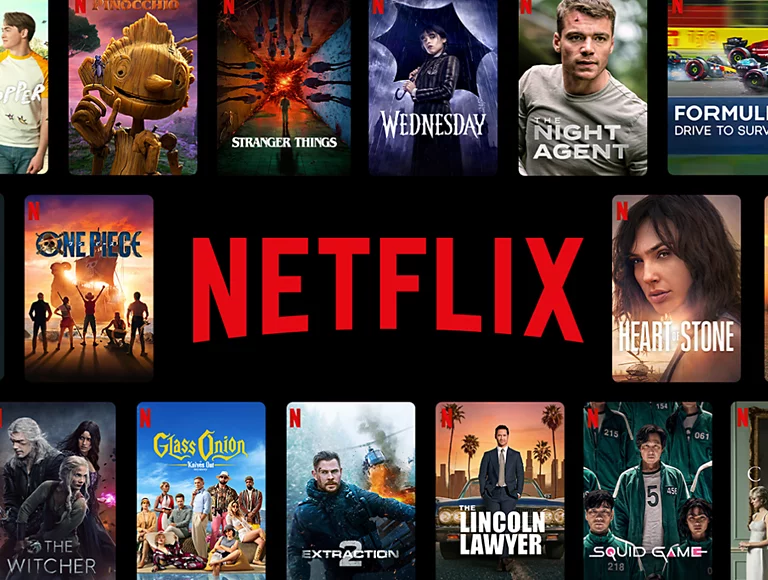

# Netflix Data Analysis Project

## Overview
This project performs comprehensive data analysis on Netflix's shows and movies dataset using Python's Pandas and Seaborn. The analysis includes a thorough data cleaning process followed by answering specific business questions to derive meaningful insights about Netflix's content library.

## Data Cleaning Process
The dataset underwent a rigorous 8-step cleaning process to ensure data quality:

  
Click to view Data Cleaning Details

  1. **Irrelevant Data Removal**
     - Eliminated non-essential data based on business objectives
     - Focused on maintaining relevant features for analysis

  2. **Missing Data Handling**
     - Addressed NULL values and blank entries
     - Applied appropriate imputation or removal strategies

  3. **Duplicate Data Elimination**
     - Identified and removed duplicate entries
     - Ensured data uniqueness

  4. **Structural Error Correction**
     - Fixed inconsistent naming conventions
     - Corrected typos and capitalization issues

  5. **Data Type Conversion**
     - Standardized data types (String, Integer, DateTime, Timestamp)
     - Ensured proper format for analysis

  6. **Data Standardization**
     - Normalized units for consistency
     - Standardized scales across variables

  7. **Outlier Management**
     - Applied Interquartile Rule for outlier detection
     - Analyzed and handled extreme values

  8. **Data Validation**
     - Performed final checks for data integrity
     - Verified data consistency

## Business Questions Analyzed

The analysis answers several key business questions including:

- Show identification and director information for specific titles
- Temporal analysis of content release patterns
- Distribution of Movies vs TV Shows
- Country-specific content analysis
- Director contribution analysis
- Content categorization and filtering
- Cast member analysis
- Rating distribution and analysis
- Duration analysis
- Content sorting and filtering capabilities

## Results Highlights

- Identified peak years for content release
- Analyzed content distribution across different countries
- Discovered popular directors and their contributions
- Mapped rating distributions across regions
- Identified content patterns and trends

## Technology Stack

- Python
- Pandas for data manipulation
- Seaborn for visualization
- Jupyter Notebook for development
